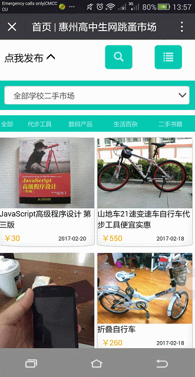

# November 2015 works

> A flea market or swap meet is a type of bazaar where inexpensive or secondhand goods are sold or bartered




## Installation

1. Clone

    ```bash
   git clone https://github.com/frehaiku/Past-Work.git
    ```
    
2. Modify the db config(`Application/Home/Conf/config.php`)

    ```php
    <?php
    return array(
        'DB_TYPE'               =>  'MySql',
        'DB_HOST'               =>  '',             
        'DB_NAME'               =>  'root',
        'DB_USER'               =>  '123',
        'DB_PWD'                =>  'psd',
        'DB_PORT'               =>  '',
        'DB_PREFIX'             =>  'goods',
    );
    ```

3. Insert `.sql` to your database

## Dependence

- Frontend : `BootStrap`、`Jquery`
- Backend : `Thinkphp`、`wechatSDK`
- The `wechatSDK` write in [Repository](https://github.com/frehaiku/wechatAPI)


## Demo

- [Click here](http://www.hkuboss.cn/fleamarket/)
- WeChat Display
    1. Follow "驴行记" official Account
    2. Send the message "2015二手市场"
    3. Click the href enter into the Work
    
## Feature

- User `openid` to build a user system, the first operation need to improve personal information
- Publish the goods using `enctype="multipart/form-data"` to synchronously submit form, preview the picture using the `FileReader` interface,use `filter` compatible IE
- Merchandise list page supports viewing into different schools
- Product details page support comment consultation feature
- Support product name search feature
- For some bad information, we can report it
- the admin page can freeze user's account(later can not be released) and delete the post