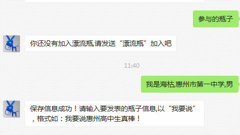

# Whispering

> (Nov,11th,2015)Throw the word which you want to say into the sea.You said the words will be picked up by the affinity.You can communicate with each other,start your private trip it!



## Installation

1. Clone

    ```bash
   git clone https://github.com/frehaiku/Past-Work.git
    ```
    
2. Insert `.sql` to your database

## Dependence

- The `wechatSDK` write in [Repository](https://github.com/frehaiku/wechatAPI)

## Demo

1. Follow "驴行记" official Account
2. Send the message "漂流瓶"